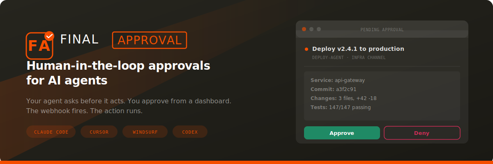

<p align="center">
  
</p>

<p align="center">
  <strong>Your AI agent asks before it acts. You approve from a dashboard. The webhook fires. The action runs.</strong>
</p>

<p align="center">
  <a href="https://finalapproval.ai">Website</a> · <a href="https://finalapproval.ai/install">Install Guide</a> · <a href="https://github.com/finalapproval/final-approval-skills/issues">Issues</a>
</p>

---

## The problem

AI agents are getting good at doing things. The question is: **should they?**

One wrong deployment, one accidental email blast, one rogue database migration — and your agent just did something you can't undo. Guardrails today are either too loose (YOLO mode) or too tight (approve every file write).

**FinalApproval sits at the exact inflection point.** You define what needs a human sign-off. Everything else flows freely.

## How it works

```
Agent wants to act → submits approval request → human reviews in dashboard → approved/denied → webhook fires → agent continues or aborts
```

That's the whole loop. Three things make it practical:

1. **Rich approval cards** — your agent sends structured HTML so the reviewer sees exactly what's about to happen (recipient, amount, diff, whatever matters)
2. **Webhooks with HMAC verification** — the decision flows back into your code securely, not through polling or prayer
3. **Works with every major AI coding tool** — Claude Code, Cursor, Windsurf, Codex

## Install

**Claude Code** (recommended)

```
/plugin marketplace add finalapproval/final-approval-skills
/plugin install finalapproval@final-approval-skills
```

**Cursor, Windsurf, Codex — or any project**

```bash
npx final-approval-skills
```

Auto-detects your tool and installs the right format. Add `--global` to install for all projects.

**Check for updates**

```bash
npx final-approval-skills --check
```

Re-run `npx final-approval-skills` to upgrade — it always fetches the latest.

## Usage

Describe the approval you need in one sentence. The skill provisions a FinalApproval channel — the dashboard, the API key, the optional webhook — and hands your agent the integration snippet.

| Tool          | Invoke                                         |
| ------------- | ---------------------------------------------- |
| Claude Code   | `/create-channel`                              |
| Cursor        | `@create-channel`                              |
| Windsurf      | `"create an approval channel for …"`           |
| Codex         | `$create-channel`                              |

### What you get

When you create a channel, FinalApproval gives you:

- **A dashboard** to review, approve, or deny pending requests
- **An API key** (`fa_...`) to submit approval requests from your code
- **A webhook secret** (`whsec_...`) to verify incoming decisions (if you set a webhook URL)
- **Drop-in code** — the skill generates a typed submission function and webhook handler tailored to your use case

### Example: gating email sends

```typescript
// Your agent builds the approval request
const approvalId = await submitForApproval({
  recipient: "alice@example.com",
  subject: "Your April product update",
  body: emailHtml,
  priority: "high",
});
// The action is now pending — a human reviews it in the dashboard
// On approval, your webhook fires and the email sends
```

The reviewer sees a rich card with the recipient, subject, and body preview — enough context to make a confident decision without digging through logs.

## Use cases

| Use case | What the agent submits | What the human checks |
|---|---|---|
| **Email campaigns** | Recipients, subject, body preview | Content, audience, timing |
| **Production deploys** | Service, commit, diff summary, test results | Risk, rollback plan |
| **Billing charges** | Customer, amount, description | Correctness, authorization |
| **Social media posts** | Platform, content, images | Brand voice, compliance |
| **Database migrations** | SQL, affected tables, row counts | Safety, reversibility |
| **API key provisioning** | Scope, expiration, requester | Least privilege |

If an AI agent can do it, FinalApproval can gate it.

## Available skills

| Skill            | Description                                                                               |
| ---------------- | ----------------------------------------------------------------------------------------- |
| `create-channel` | Create a FinalApproval channel to gate an agent action behind human approval              |

**Coming next:** `approval-policy` — routing rules, auto-approve conditions, multi-signer flows.

## Docs & dashboard

- **Dashboard:** [finalapproval.ai](https://finalapproval.ai)
- **Install guide:** [finalapproval.ai/install](https://finalapproval.ai/install)
- **Webhook verification:** Node + Python drop-ins available in the dashboard under each channel

---

## Contributing

1. Fork this repo
2. Add `skills/<your-skill-name>/SKILL.md` with YAML frontmatter + instructions
3. (Optional) Add a `templates/` directory for template files
4. Open a PR

### SKILL.md format

```yaml
---
name: my-skill-name
description: Short description of what the skill does
argument-hint: [what arguments the skill accepts]
---

# Skill Title

Instructions for the AI to follow when this skill is invoked.
```

## License

MIT
